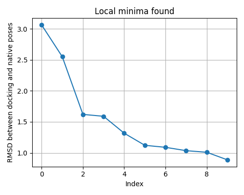
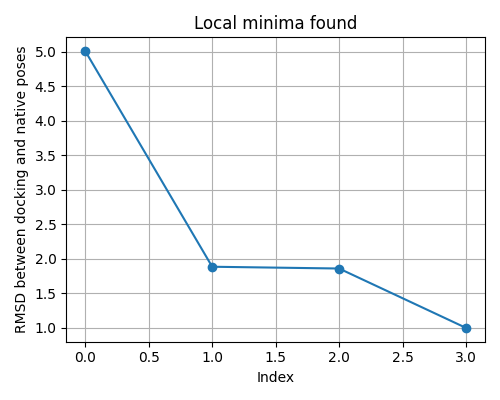

# Vina Scoring RMSD Optimizer

This repository contains code for customizing the scoring function of the docking tool [Uni-Dock](https://github.com/dptech-corp/Uni-Dock), a GPU-accelerated analogue of AutoDock Vina. The goal is to adjust the scoring function coefficients to improve the likelihood of producing native-like docking poses — specifically minimizing the RMSD between docked and reference conformations.

> Related study: [10.1016/j.compbiolchem.2016.04.005](http://dx.doi.org/10.1016/j.compbiolchem.2016.04.005)

---

## 🔍 Problem Motivation

Traditional docking typically aims to rank compounds by predicted binding affinity. However, **it does not guarantee a native-like pose**, especially in single-ligand cases. While this is acceptable in large-scale virtual screening, it becomes limiting for tasks like fine-tuned docking against a specific binding site.

This project shifts the goal: instead of maximizing docking score, it **minimizes RMSD** between the docked and native pose. This is done by **optimizing the 5 coefficients in the Vina scoring function** to yield better geometrical accuracy (not affinity estimation).

> ⚠️ Note: After scoring function customization, docking scores should no longer be interpreted as binding affinities.

---

## ✨ Key Features

- 🔬 **Custom Objective Function**: Computes the RMSD between docked and native pose (or mean RMSD over multiple ligands).
- 🚀 **Global Optimization**: Uses `scipy.optimize.differential_evolution` for global minimum search.
- 📈 **Log and Visualization Tools**: Results and local minima are logged, and visualized via matplotlib or plotext.
- 🧠 **Supports Multi-Ligand RMSD Averaging**: Useful for capturing binding site-specific preferences.
- 🛠️ Based on a modern, maintainable codebase (unlike the original paper, whose code was not publicly available).

---

## 🗂 Repository Structure

`````
├── app/
│ ├── customize_scoring_function.py # Main optimization program
│ ├── load_data.py # Initial files handling
│ ├── process_output.py # Extract poses, compute RMSD
│ ├── logger.py # Logging optimization results
│ └── __init__.py
├── main.py # Entrypoint for launching optimization
├── parameters.py
├── check_results.py # Plotting and result evaluation
├── images/ # Contains sample plots (see below)
`````


---

## 📊 Sample Output


Two example plots show the process of finding the best solution for a particular ligand and protein.  
RMSD trend over visited local minima:

- **Y-axis**: Mean RMSD for a set of ligands
- **X-axis**: Index of visited local minimum during optimization




---

## 🔧 How It Works

1. User provides:
   - A set of ligand files and protein files

2. The optimizer:
   - Performs docking using Uni-Dock with initial common coefficients of Vina
   - Extracts the first docked pose
   - Computes RMSD between this pose and the native one

3. The objective function:
   - Returns RMSD (or mean RMSD for multi-ligand setups)
   - Guides the optimizer (currently `differential_evolution`)

---

## 📌 Notes

- This codebase is under active development and will serve as the basis for a future publication.
- Currently, **Differential Evolution** is implemented as the global search algorithm, as it provided the best convergence behavior on our datasets.
- Future updates may include support for other global optimization methods.

---

## 📄 License

**No license specified.** This code is currently closed for public reuse and is intended for research purposes.

---

## 📬 Contact

If you're interested in collaboration or early access for research, feel free to reach out via GitHub issues or email.
